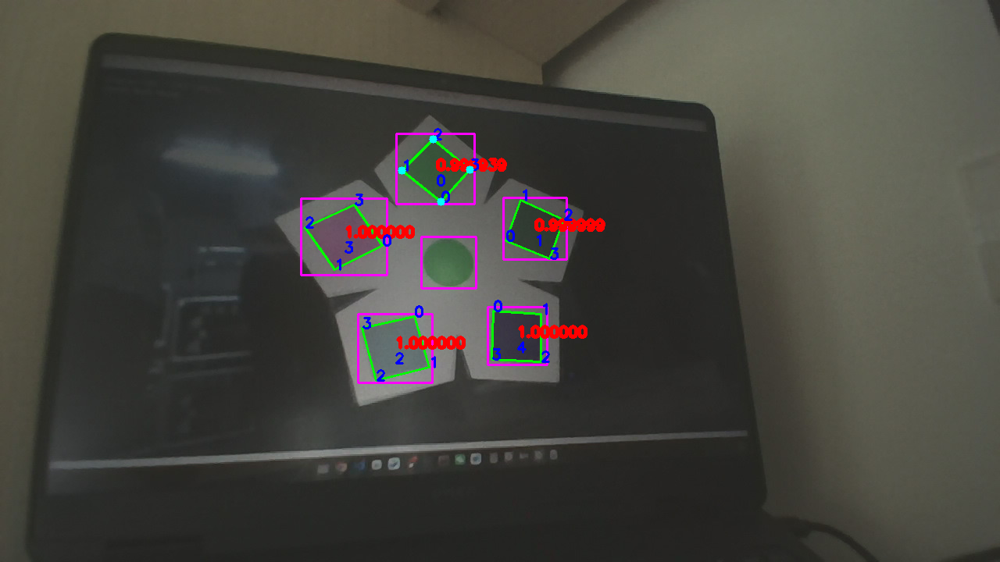

# ATRI_vision

[](https://docs.ros.org/en/humble/)
[](https://releases.ubuntu.com/22.04/)
[](https://github.com/adoreATRI/ATRI-vision/commits)
[](https://wakatime.com/badge/user/443521ff-7869-4a48-80fb-220219ed06d5/project/c83365d2-fcdd-4099-ad67-047a21f3dc4a)

## 1. 项目介绍

### 1.1 功能介绍

- `atri_detector` 功能包：检测运动色块，发布色块位姿
- `atri_interfaces` 功能包：提供接口功能包
- `atri_keyboard` 功能包：提供键盘控制功能包
- `atri_serial_driver` 功能包：使用华师开源的 `rm_buff` 的串口功能包，调整了键盘控制部分
- `atri_tracker` 功能包：使用华师开源的 `rm_buff` 追踪器，调整了 EKF 运动模型和参数
- `ATRI_usb_camera` 功能包：有重连功能的 USB 相机功能包，默认发布 JPEG 压缩图像
- `simulator` 功能包：仿真器

## 2. 部署

### 2.1 获取仓库和子模块

本项目使用 submodule 管理 `ATRI_usb_camera` 功能包，首次克隆时建议使用：

```bash
git clone --recursive https://github.com/adoreATRI/ATRI-vision.git
```

如果已经克隆了仓库，但 `src/ATRI_usb_camera` 目录为空或没有拉取完整内容，在仓库根目录运行：

```bash
git submodule update --init --recursive
```

后续更新仓库时，如果子模块也有更新，可以运行：

```bash
git pull
git submodule update --init --recursive
```

### 2.2 ONNXRuntime

下载对应适合自己系统的版本，在 `.bashrc` 中添加以下内容：

```bash
export ONNXRUNTIME_DIR=$HOME/onnxruntime-*
```

### 2.3 修改参数

- 将 `ATRI_usb_camera/config/camera_info.yaml` 替换成自己的相机参数，并使用自身相机的 `camera_path`
- `atri_detector` 的 `pnp_solver` 的目标大小
- `atri_tracker` 中 `tracker.hpp` 中 `BUFF_R` 的大小
- `atri_serial_driver` 中的 TF 树调整和时间补偿

## 3. 编译和运行

```bash
colcon build --symlink-install --cmake-args -DCMAKE_BUILD_TYPE=Release

source install/setup.bash
ros2 launch bringup launch.py
```

## 4. 按键控制节点的运行

在`ATRI_vision`的根目录终端运行以下命令：

```bash
source install/setup.bash
ros2 run atri_keyboard keyboard_node
```

按键说明：

- `r` 控制重置检测器和追踪器状态，并切换能量机关模式
- `s` 控制数据的发送

## 5. 其他工具的使用

### 5.1 仿真器的使用

运行

```bash
/usr/bin/env python3 ./src/simulator/buff_simulator.py
```

仿真器使用说明：

| 按键 | 说明 |
| --- | --- |
| `r` | 重置色块颜色 |
| `m` | 切换能量机关模式 |
| `d` | 切换方向 |
| `p` | 重置参数 |

### 5.2 调试工具

```bash
ros2 run plotjuggler plotjuggler

ros2 bag record -o bags/01 /detector/color_blocks /tf /tf_static
```

## 6. 效果演示

### 仿真环境




### 真实环境


