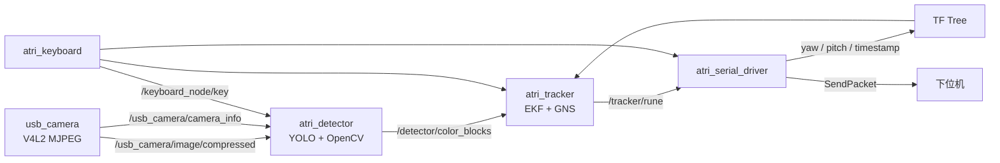
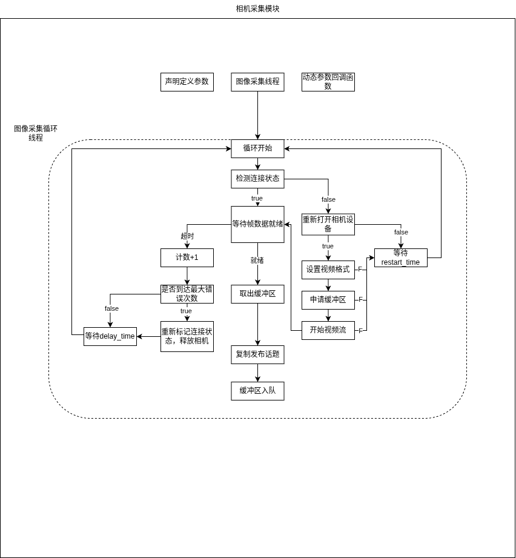
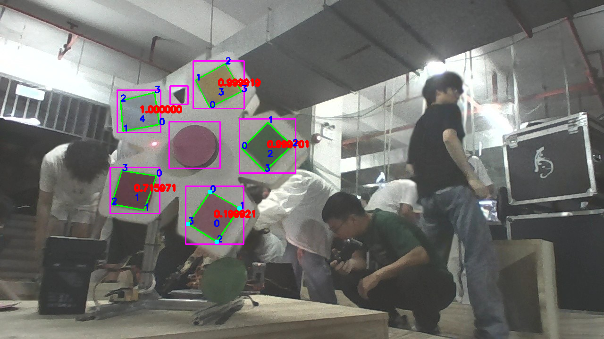
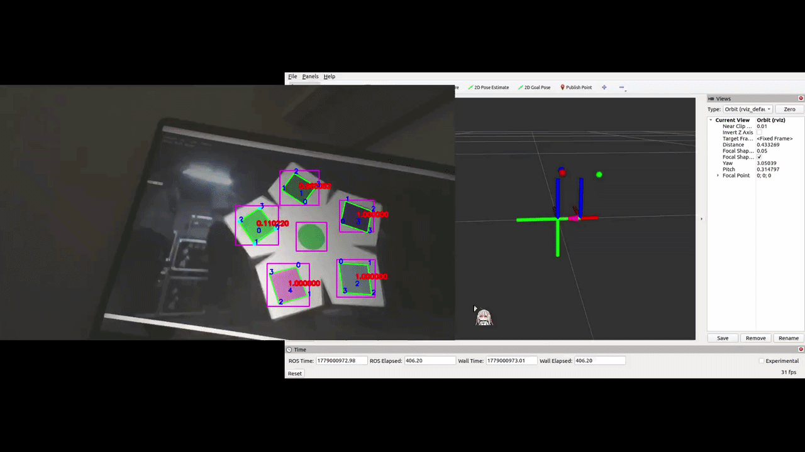

# 机甲杯视觉算法技术报告

钟梓阳

## 1 前言

本文档描述机甲杯视觉算法的设计方案和技术路线。

项目包含以下主要功能包：

| 功能包 | 作用 |
| --- | --- |
| `usb_camera` | 基于 Linux V4L2 的 USB 相机采集，发布压缩图像、原始图像和相机内参 |
| `atri_detector` | 识别能量机关色块，完成目标色块锁定和 PnP 位姿解算 |
| `atri_tracker` | 对色块和能量机关中心进行追踪、滤波和大符转速参数估计 |
| `atri_serial_driver` | 接收下位机云台角度和时间戳，发布动态 TF，并向下位机发送预测姿态 |
| `atri_interfaces` | 定义 `ColorBlock`、`Rune`、`TimeInfo` 等自定义消息 |
| `atri_keyboard` | 提供键盘控制接口，用于重置、模式切换和发送控制 |
| `bringup` | 统一启动相机、检测器、追踪器、串口和 RViz 调试配置 |
| `simulator` | 提供能量机关仿真画面，用于检测算法离线调试 |

系统数据流如下：

## 2 项目开发路线

### 2.1 USB 相机采集模块

大部分校内比赛都是用 USB 相机，当然也有部分队伍用更加方便的模块，但是为了挑战自己（bushi），为了省钱，我最终选择了 60 帧的 USB 相机。

一开始我的知识储备并不是很充足，就单用 OpenCV 对相机进行调用采集，发布原始图像，理所当然地无法进行下去，10 FPS 的图像流能干嘛？

后面学习到更多的相机知识和 ROS 2 的功能包设计，开始研究第一个功能包，不过还是用 OpenCV 进行开发的，添加了参数回调的功能，但是测试的时候发现，相机的帧率卡在 30 帧，当初我以为是商家卖假货给我，后面排除问题，发现自己怎么都找不到问题。这时候就请神上身（Copilot 上场，好怀念当初大方的 Copilot，www），马上发现了问题，是 OpenCV 使用JPEG采集并发布话题过程中，会自动对视频流进行一次解码，拉低了图像发布频率。于是使用了 Linux 的 V4L2 接口，直接发布压缩图像，这样就解决了帧率问题。

但是最主要的研发还是在断线重连功能的开发上。看到任务规则中说明的，要先启动程序，后面再接入相机。同时考虑到相机线可能容易松动，所以如果可以实现程序一直运行，实时对接入硬件进行参数设定和图像采集就好了，基于此目标，经过几次迭代写出了这个逻辑框架。

同时我觉得 USB 相机比较常用，于是稍微整理了一下这个功能包 [ATRI_usb_camera](https://github.com/adoreATRI/ATRI_usb_camera.git)，进行开源，并且会对其长期维护，欢迎大家使用和提 issue 和 PR。

### 2.2 检测器

这部分是我开发花的时间最多的模块，主要是这个模块是比赛要求的核心。

#### 2.2.1 提取掩码

最开始时是使用整张图片进行图像处理，考虑到 H 值不容易发生变化，S 值下白色背景与色块可以比较明显地区分开来，二值化采用的是 HSV 空间下的 H 和 S 的全局阈值分割，但是实测发现，光线变化对 S 值的影响很大，这种处理方法鲁棒性满足不了比赛需求。

考虑到光线变化，从湖大的视觉圣经中获得灵感，开始往自适应方向发展，有全局自动阈值和局部自适应阈值两种方法。经过测试，发现局部自适应阈值表现非常不错，于是采用了后者方案。

#### 2.2.2 色块检测

最初的方案是使用严格的几何特征对色块进行约束，比如面积、长宽比、距圆心的距离等，虽然严格的几何约束可以排除大部分噪声，但是仍可能会存在误差，同时太过严格也可能会排除真实色块。

学习 YOLO 后，感觉其对解决这个问题非常有帮助，于是采集仿真图像进行训练，裁剪 ROI 区域进行图像处理，可以有效排除大部分干扰，提升检测稳定性，同时可以放宽几何约束。

在放宽几何约束的时候，我发现好像可以将色块识别和圆形色块解耦，具体方案后面再介绍，就是实现在圆形色块检测失败的情况下，也可以实现对色块的检测，提升系统的鲁棒性。（虽然后面在比赛中并没有用上，同一帧下基本所有色块都在画面，但是可以作为一个思路参考）

该方案在仿真中效果表现非常好，但是热身赛实测发现，YOLO 基本检测不到色块（后面发现原因是：1. 相机参数设定有问题，导致图像质量堪忧；2. 模型没保留颜色特征），所以采集实地照片和仿真照片标注，关掉 HS 偏移和几何畸变超参数进行训练，得到了新一版保留颜色特征的模型，很好地完成了色块检测任务。

#### 2.2.3 色块识别

这个部分要求选定和圆形色块颜色相同的矩形色块。

最初的方案是对每一帧图像进行一次识别，对每个矩形色块和圆形色块中心环形区域（这样设计是为了排除色块边界影响和激光光照的影响，虽然后面发现色块基本保持不了在色块中心位置）进行一个 Lab 颜色空间 a、b 通道距离计算，效果勉强还可以，但是在圆形色块消失的情况下无法进行识别，同时对黑色色块的识别效果不好（比赛将黑色色块删了。。。原因有点无法理解，这不是选手代码自适应的问题吗？为什么要改规则？）

后面使用 H 和 S 的二维直方图作为一个对象特征，比较好地实现了色块识别功能，但是在高曝光情况下，对粉色与红色的区分有点问题，可以采用降低曝光进行缓解。

#### 2.2.4 圆形色块解耦

该功能是在放宽几何约束的时候想到的。圆形色块的作用是提供一个颜色特征用于色块识别和圆心位置用于几何约束，色块识别的话，可以在学习阶段（学习-锁定是我挺喜欢的一个处理逻辑，后面会经常看到相关处理）获取圆形色块的 HS 直方图作为识别特征，锁定后就不再更新，几何约束放宽不使用圆心位置，就实现了一个解耦设计。

#### 2.2.5 PnP 位姿解算

对识别的色块进行 PnP 位姿解算获得三维位姿，因为获得的色块角点精度还可以，点序保持稳定，所以采用PnP位姿解算

#### 2.2.6 不足

- 在热身赛测试到 YOLO 无法识别的时候，我在检测器部分添加了一个降级方案，当 YOLO 输出结果不符合预期的时候，切换到传统视觉方案。但是切换逻辑做得不是很好，可以删除或者让切换的条件更清晰具体。同时切换到的传统视觉方案效果也不好，可以补充几何约束减少噪声。

### 2.3 追踪器

考虑到视觉任务描述很符合 RM 的能量机关，所以不再对追踪器底层算法进行开发，使用 `rm_buff` 的开源，进行本地化修改。

添加了旋转轴的学习和锁定逻辑，使其适应比赛要求，将大/小符切换变成按键控制，更适合比赛要求。

没往这方面学，一个是因为我想投入更多时间在导航方面的学习，另一个是因为有点学不懂 GNS 的原理（看着看着睡着了），所以这部分可能只是一个项目部署和调参部分，调完参的 EKF 效果如下。

不足的地方：大小符的切换是使用默认参数和键盘进行控制，比赛的时候因为紧张，忘记切换模式了，用小符模式追大符，导致效果非常差。但是在短时间的任务中，我觉得手动切换方法是没有错的，我可以在可视化中添加一个大点的提示，可能就不会忘

### 2.4 串口通信

使用了 `rm_serial_driver` 进行串口通信，添加了按键控制和角度解算功能，很普通的串口功能包，学会了基本的串口通信。

## 3. 总结

整个项目对色块的检测和识别效果表现不错，追踪器在 RViz 中呈现的预测效果也不错，但是在比赛过程中，我们的云台对色块的追踪效果不太好，主要呈现一个抖动的问题，这部分当初我和电控队友并没有进行一个很好的解决，这是一个很大的遗憾。

## 4. 写在后面的话

这个项目是我刚学习完 ROS 2 进行开发的，可能部分内容比较生疏，见谅。整个项目大概一半是自研，一半是基于开源进行修改的，emmm，我个人的知识储备是比较有限的，所以实在无法从零开发一个完整的能量机关视觉系统，希望我开源的相机功能包可以对大家有所帮助，检测器的开发思路对于想要开发类似系统的同学可能会有一些参考价值，追踪器和串口部分主要是一个本地化部署和调参的过程，可能帮助不大，但是也欢迎大家参考。很感谢我的队友们的付出，诶，如果我再多会一点电控知识是不是就不一样了。

## 5. 参考资料

- [rm_vision](https://github.com/FaterYU/rm_vision.git)
- [rm_buff](https://github.com/FaterYU/rm_buff.git)
- [湖南大学视觉圣经](https://scutrobotlab.feishu.cn/wiki/URuowYV3JiYnY1kHgskcMEdGnwf)
